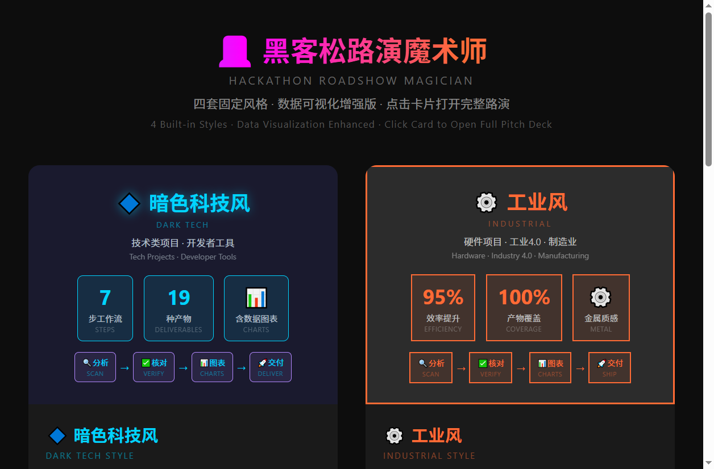

<div align="center">

#  黑客松路演魔术师
## Hackathon Roadshow Magician

**黑客松专属路演全链助手 · The All-in-One Roadshow Assistant for Hackathons**

[](LICENSE)
[](CHANGELOG.md)
[]()

**把任意成果源代码一键转换为竞赛级路演材料**
*From source code to stage-ready pitch — in one conversation*

---



**🎨 4+1视觉风格 | 📊 17种专业图表 | 🌍 中英双语 | 📦 19种产物**

</div>

---

## 📖 项目简介 | Introduction

### 🇳 中文

### 黑客松路演魔术师：对话式路演材料全链路生成助手

只需上传项目源码、文档或链接，系统将自动完成深度分析、信息校验、路演场景匹配、大纲构建、图表生成全流程，最终输出**6大维度版本 × 19种路演产物**。全程采用7步确认式交互，帮你把时间从排版措辞、材料拼凑中解放出来，专注打磨DEMO本身。

#### 直击核心痛点

黑客松的核心竞争力是产品DEMO的完成度，但绝大多数团队都栽在路演环节：要么缺乏路演叙事能力，内容抓不住重点；要么耗费大量精力打磨路演材料，挤占了本应用于完善功能、搭建DEMO的核心时间。

#### 核心差异化能力

1. **深度理解，绝非模板套壳**
   不靠固定模板生搬硬套，而是真正读取项目源代码与文档，吃透技术逻辑与产品价值后，生成完全匹配项目的定制化路演内容。

2. **7步交互，全程方向可控**
   标准化7步节点式交互，每个关键环节都设置确认点，AI只执行指令、不擅自决策，路演的叙事方向与内容权重完全由你掌控，从根源避免输出跑偏。

3. **全链路交付，一站式覆盖**
   覆盖赛前提报、现场路演、赛后传播全场景，一次性输出19种路演产物，无需跨工具东拼西凑；内置4+1套视觉风格（暗色科技/工业/卡通/赛博朋克/自定义），同一套内容可快速切换不同表达风格，适配不同赛场要求。

#### 三重可靠保障

- **数据真实铁律**：所有数据均标注信息来源，无权威来源的内容统一保留占位符，绝不虚构任何信息
- **三级容错工具链**：每个生成环节均配置「主工具→备用方案→降级策略」三级保障，确保高生成成功率
- **纯本地运行**：项目代码与数据全程不离开你的设备，国内网络环境可无障碍使用，安全无顾虑

---

### 🇸 English

### Hackathon Roadshow Magician: A Conversational All-in-One Pitch Material Generator

Simply upload your project source code, documentation, or links — the system automatically handles deep analysis, information verification, pitch scenario matching, outline construction, and chart generation, ultimately delivering **6-dimensional variants × 19 pitch deliverables**. The entire process follows a 7-step confirmation workflow, freeing you from formatting, phrasing, and material patchwork so you can focus on polishing your demo.

#### The Core Pain Point

A hackathon's competitive edge lies in demo completeness, yet most teams stumble at the pitch stage: either they lack narrative skills and miss the key points, or they spend so much energy on pitch materials that it eats into the time meant for building and refining the demo itself.

#### Key Differentiators

1. **Deep Understanding, Not Template Copy-Paste**
   No rigid templates slapped on. It genuinely reads your source code and documentation, grasps the technical logic and product value, then generates fully customized pitch content tailored to your project.

2. **7-Step Interactive Flow, Full Direction Control**
   A standardized 7-step checkpoint workflow where every critical stage requires your confirmation. AI executes — never decides. The narrative direction and content priorities are entirely yours, eliminating off-track outputs from the root.

3. **Full-Pipeline Delivery, One-Stop Coverage**
   Covers pre-event registration, live pitching, and post-event amplification in a single pipeline — 19 deliverables at once, no cross-tool patchwork. Built-in 4+1 visual styles (Dark Tech / Industrial / Cartoon / Cyberpunk / Custom), letting you switch expressions instantly to match different competition requirements.

#### Triple Reliability Guarantees

- **Data Integrity Iron Rule**: Every data point cites its source. Content without authoritative backing gets a placeholder — nothing is ever fabricated.
- **3-Tier Fault-Tolerant Toolchain**: Every generation step is backed by a "Primary → Backup → Fallback" chain, ensuring high success rates.
- **Pure Local Execution**: Your code and data never leave your device. Works seamlessly in China's network environment — no VPN needed, no security concerns.

---

## 🎯 应用场景 | Use Cases

### 🇨🇳 中文

| 场景 | 说明 |
|------|------|
| **黑客松竞赛** | Demo完成后快速生成路演材料，把时间还给产品打磨 |
| **技术答辩** | 毕业答辩、职称评审、技术评审，结构化呈现技术方案 |
| **融资路演** | 向投资人展示产品价值、商业模式和团队能力 |
| **产品发布** | 新品上线、功能迭代时的推广展示材料 |
| **电梯演讲** | 30秒内说清项目价值，适合社交场合快速介绍 |
| **展位展示** | 展会、集市、开放日等互动展示场景 |
| **技术讲课** | 内部分享、技术沙龙、培训课程的课件准备 |
| **资源对接** | 寻找合作伙伴、产业资源、媒体曝光时的项目介绍 |
| **开源推广** | 为开源项目制作展示材料，吸引社区参与 |
| **创业比赛** | 各类创新创业大赛的路演材料准备 |

### 🇸 English

| Scenario | Description |
|----------|-------------|
| **Hackathon Demo Day** | Generate pitch materials fast after your demo works — give time back to the product |
| **Technical Defense** | Thesis defense, promotion review, technical evaluation — structured tech presentation |
| **Investor Pitch** | Present product value, business model, and team capability to investors |
| **Product Launch** | Marketing materials for new product or feature releases |
| **Elevator Pitch** | Explain your project's value in 30 seconds — perfect for networking |
| **Booth Showcase** | Interactive demos at exhibitions, markets, open days |
| **Tech Workshop** | Internal sharing, tech meetups, training course materials |
| **Partnering** | Project introductions for finding partners, industry resources, media exposure |
| **Open Source Promotion** | Showcase materials to attract community participation |
| **Startup Competition** | Pitch deck preparation for innovation & entrepreneurship contests |

---

##  适用人群 | Who Is This For

### 🇳 中文

- **黑客松参赛者**：Demo做完了，路演还没开始写
- **技术创业者**：需要向投资人/评委展示技术方案
- **高校师生**：毕业答辩、课程设计展示、创新创业比赛
- **开源开发者**：为开源项目制作专业展示材料
- **产品经理**：产品发布、内部汇报、跨部门沟通
- **技术讲师**：技术分享、培训课程、工作坊准备

### 🇺🇸 English

- **Hackathon participants**: Demo is done, pitch hasn't started
- **Tech founders**: Need to present tech solutions to investors/judges
- **Students & professors**: Thesis defense, course presentations, startup competitions
- **Open source developers**: Professional showcase materials for OSS projects
- **Product managers**: Product launches, internal reports, cross-team communication
- **Tech educators**: Tech sharing, training courses, workshop preparation

---

## ✨ 核心特性 | Key Features

| 特性 | Feature | 说明 | Description |
|------|---------|------|-------------|
| 🎯 **7步工作流** | 7-Step Workflow | 源码分析→核对→定类→大纲→图表→生成→交付 | Analyze → Verify → Classify → Outline → Visualize → Generate → Deliver |
| 🎪 **8类路演类型** | 8 Pitch Formats | 竞赛/投资/答辩/推广/电梯/展位/讲课/对接 | Demo Day / Investor / Defense / Launch / Elevator / Booth / Workshop / Partnering |
| 🎨 **4+1视觉风格** | 4+1 Visual Styles | 暗色科技/工业/卡通/赛博朋克/自定义 | Dark Tech / Industrial / Cartoon / Cyberpunk / Custom |
| 📊 **17种专业图表** | 17 Chart Types | 流程图/架构图/UML/ER/关系图/3D/手绘等 | Flowcharts / Architecture / UML / ER / Graphs / 3D / Hand-drawn |
|  **中英双语** | Bilingual Ready | 中文为主、英文点缀，风格差异化排版 | CN-primary, EN-accent, style-matched typography |
| 🎭 **六维版本矩阵** | 6D Variant Matrix | 时长×侧重×风格×格式×语言×团队 | Length × Focus × Tone × Format × Language × Team |
| 📦 **19种产物** | 19 Deliverables | 赛前提报4+现场展示5+评委互动4+赛后传播4+存档复用2 | Pre-event 4 + Onstage 5 + Q&A 4 + Amplify 4 + Archive 2 |
| ️ **三级工具链** | 3-Tier Toolchain | 主工具→备用(开源高赞)→降级方案 | Primary → Backup (open-source) → Fallback |
| 🔒 **完全本地运行** | Fully Local | 绝不联网、绝不外传 | Runs entirely on your machine — nothing leaves your device |

---

## 🎨 视觉风格预览 | Style Showcase

| 暗色科技风 | 工业风 | 卡通风 | 赛博朋克风 |
|:---:|:---:|:---:|:---:|
| Dark Tech | Industrial | Cartoon | Cyberpunk |
| #1A1A2E + #00D4FF | #2C2C2C + #FF6B35 | #FFF8E7 + #FF6B6B | #0D0D0D + #FF00FF/#00FFFF |
| 霓虹发光 · 科技感 | 硬朗线条 · 金属质感 | 圆润可爱 · 活泼有趣 | 霓虹渐变 · 故障艺术 |

---

## 🚀 快速开始 | Quick Start

### 🇨🇳 中文

1. **触发**：对AI助手说"黑客松路演"或"帮我做路演材料"
2. **丢入项目**：提供你的成果项目路径（源代码/文档/链接）
3. **7步交互**：按SOP流程确认信息、选择类型、审核大纲、选择风格
4. **获取产物**：多风格HTML路演页 + 演讲稿 + 问答 + 图表 + 推广样品截图

### 🇺🇸 English

1. **Kick it off**: Say "hackathon roadshow" or "help me build a pitch"
2. **Drop in your project**: Point it at your source code, docs, or links
3. **Walk through 7 steps**: Confirm details, pick format & style, review outline
4. **Get your deck**: Multi-style HTML pages + speaker script + Q&A prep + charts + promo screenshots

---

## 📐 架构 | Architecture

```
┌─────────────────────────────────────────────────────┐
│  Layer 1 · 场景层 (Scenarios)                        │
│  8类路演全覆盖 (8 Pitch Formats)                     │
├─────────────────────────────────────────────────────
│  Layer 2 · SOP层 (Workflow)                          │
│  7步工作流 · 5个确认点 (7 Steps · 5 Checkpoints)     │
├─────────────────────────────────────────────────────┤
│  Layer 3 · 工具层 (Tools)                            │
│  三级工具链 · 17种图表 · 7种布局 · 专家降级           │
├─────────────────────────────────────────────────────
│  Layer 4 · 视觉层 (Visuals)                          │
│  4+1风格 · 中英双语 · 7种渲染风格                    │
├─────────────────────────────────────────────────────┤
│  Layer 5 · 产物层 (Deliverables)                     │
│  5环节 · 19种产物 · 推广样品自动生成                 │
└─────────────────────────────────────────────────────┘
```

---

##  项目结构 | Project Structure

```
hackathon-roadshow-magician__skillhub/
── SKILL.md                 # 主文件 (Skill Definition, v1.5.0)
├── ref-roadshow-types.md    # 8类路演模板库 (Pitch Format Library)
├── ref-charts.md            # 17种图表模板与风格规范
├── 架构图.html              # 交互式架构图 (Interactive Architecture)
├── style-showcase.png       # 四风格对比预览图 (Style Showcase)
├── social-preview.png       # GitHub社交预览图 (Social Preview)
├── 路演材料/                 # 路演产物 (Generated Pitch Materials)
│   ├── 推广样品/             # 各风格截图，用于宣传 (Promo Screenshots)
│   ├── 图表素材/             # 独立图表文件 (Chart Assets)
│   ├── 风格对比/             # 单风格预览页 (Style Demos)
│   └── *_5min_完整版.html    # 四套双语风格路演页
├── CHANGELOG.md             # 版本记录 (Changelog)
├── LICENSE                  # MIT协议 (License)
└── README.md                # 本文件 (This File)
```

---

## 🎪 8类路演类型 | 8 Roadshow Types

| 类型 | Format | 叙事框架 | Narrative Arc | 默认时长 |
|------|--------|----------|--------------|----------|
| 竞赛Demo | Demo Day | 背景→痛点→市场规模→解决方案→Demo→市场反馈→竞品对比→团队荣誉→未来 | Background → Pain → Market → Solution → Demo → Feedback → Competitors → Team → Future | 15min |
| 投资路演 | Investor Pitch | 痛点→市场→产品→商业→团队→融资 | Pain → Market → Product → Business → Team → Ask | 10min |
| 技术答辩 | Tech Defense | 背景→方法→实现→验证→结论 | Background → Method → Implementation → Validation → Conclusion | 20min |
| 产品推广 | Product Launch | 场景→痛点→体验→优势→行动 | Scene → Pain → Experience → Edge → Action | 5min |
| 电梯演讲 | Elevator Pitch | 钩子→价值→差异→行动 | Hook → Value → Edge → Ask | 30s |
| 展位展示 | Booth Showcase | 亮点→Demo→互动→资源→连接 | Highlight → Demo → Engage → Assets → Connect | 3-5min |
| 技术讲课 | Workshop | 背景→概念→原理→实操→答疑 | Context → Concept → Theory → Hands-on → Q&A | 30-60min |
| 资源对接 | Partnering | 项目→价值→需求→资源→合作 | Project → Value → Needs → Resources → Partnership | 5-10min |

---

## 📦 19种产物 | 19 Deliverables

| 环节 | Stage | 产物 | Deliverables | 数量 |
|------|-------|------|--------------|------|
| 赛前提报 | Pre-event | 报名表/简介/一句话/声明 | Registration / Summary / Tagline / Declaration | 4 |
| 现场展示 | Onstage | HTML/PPT/腹稿/图表/操作清单 | HTML Deck / PPT / Speaker Notes / Charts / Demo Checklist | 5 |
| 评委互动 | Q&A | 预测问答/备忘录/技术FAQ/红线卡 | Predicted Q&A / Cheat Sheet / Tech FAQ / Red-line Card | 4 |
| 赛后传播 | Amplify | 海报/社媒文案/README/短视频脚本 | Poster / Social Copy / README / Video Script | 4 |
| 存档复用 | Archive | 项目档案/素材包 | Project Archive / Asset Bundle | 2 |

---

## ️ 三级工具链 | 3-Tier Toolchain

| 环节 | 主工具 | 备用(开源高赞) | 降级方案 |
|------|--------|---------------|----------|
| 代码搜索 | SearchCodebase | ast-grep (15.2K⭐) | Grep+Glob |
| 流程图/架构 | Mermaid.js (89K⭐) | flowchart.js / draw.io | HTML/CSS+箭头 |
| 数据图表 | Chart.js (64K⭐) | ECharts (61K⭐) | 纯CSS柱状图/进度条 |
| 关系图/依赖 | D3.js (110K⭐) | cytoscape.js (10K⭐) | HTML/CSS连线+卡片 |
| 交互动图 | ECharts (61K⭐) | Plotly.js / Leaflet | 静态SVG |
| 手绘风格 | Rough.js (20K⭐) | rough-notation | 波浪线CSS+手写字体 |
| 文件写入 | Write | Edit追加 | 分片Write拼合 |
| 渲染测试 | RunCommand | Grep验证 | 人工检查 |

---

## 🔄 生态关系 | Ecosystem

```
Golden Idea (Idea Evaluator)  →  Roadshow Magician (Pitch Builder)  →  Qinshubao (Skill Inspector)
       Should you build it?         Build the pitch                    Is the pitch good enough?
            ↑ Three tools covering the full journey from spark to stage ↑
```

---

## 📋 版本规划 | Roadmap

| 版本 | 功能 | 状态 |
|------|------|------|
| v1.0.0 | 7步工作流 + 六维版本 + 19种产物 | ✅ 已发布 |
| v1.4.0 | Ask/Plan模式 + 追问环节 + 数据铁律 + 经验库 | ✅ 已发布 |
| v1.5.0 | 4+1视觉风格 + 17种图表 + 中英双语 + 推广样品 | ✅ 当前 |
| v1.6.0 | PPT生成支持（MCP/HTML转PPT） | 🔄 规划中 |
| v1.7.0 | 协作模式（多人评审大纲） | 📋 规划中 |
| v1.8.0 | AI驱动个性化风格学习 | 📋 规划中 |

---

## 🎩 自举案例：魔术师的路演

这份README同目录下的路演材料，就是**用黑客松路演魔术师给它自己生成的**（四套风格双语版）：

- [🌑 暗色科技风 · 5min完整版](路演材料/黑客松路演魔术师_暗色科技风_5min_完整版.html) — 默认推荐，科技感十足
- [🟧 工业风 · 5min完整版](路演材料/黑客松路演魔术师_工业风_5min_完整版.html) — 硬朗金属质感
- [🎈 卡通风 · 5min完整版](路演材料/黑客松路演魔术师_卡通风_5min_完整版.html) — 活泼可爱
- [💜 赛博朋克风 · 5min完整版](路演材料/黑客松路演魔术师_赛博朋克风_5min_完整版.html) — 霓虹故障艺术
- [ 风格合集对比预览](路演材料/风格合集_对比预览.html) — 四套风格同屏对比
- [📝 5分钟演讲稿](路演材料/黑客松路演魔术师_演讲稿_5min.md) — 口语化腹稿
- [ 预测问答5min版](路演材料/黑客松路演魔术师_问答_5min.md) — 评委互动准备

> **同一个项目，同一套代码，不同的表达。** 这不是魔法，是工程化。
> *Same project, same code, different expression. Not magic — engineering.*

---

## 🤝 参与贡献 | Contributing

欢迎提 Issue 和 PR！无论是 Bug 报告、功能建议还是文档改进，都欢迎。

Issues and PRs are welcome — bug reports, feature requests, and doc improvements are all appreciated.

---

## 📄 许可证 | License

[MIT License](LICENSE) — Open source, community-friendly, build on top of it freely.

## 👤 作者 | Author

**喜气杨杨** (Xiqi Yangyang)

---

<div align="center">

**⭐ 如果这个项目帮到了你，欢迎Star支持！**
**Found it useful? Give it a Star — it helps others discover it too. ⭐**

</div>
