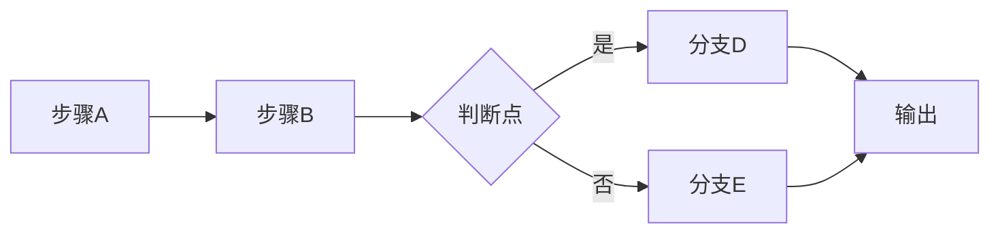
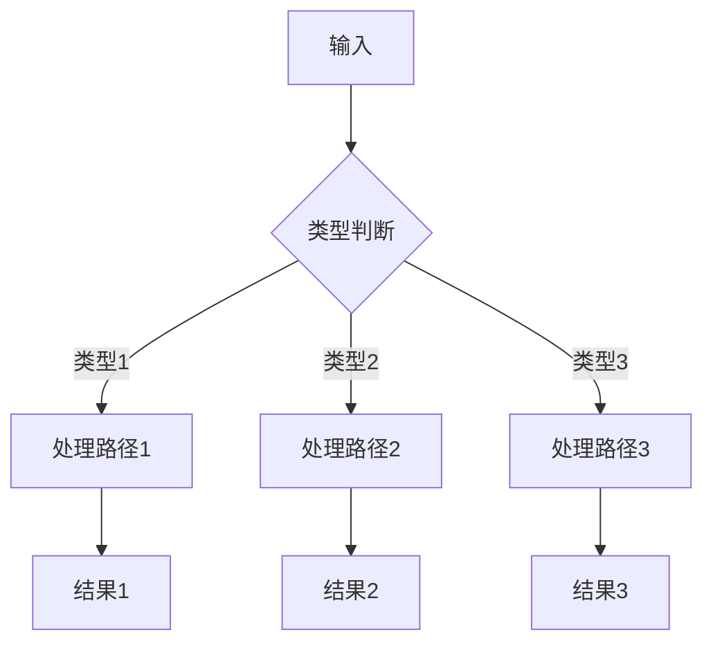
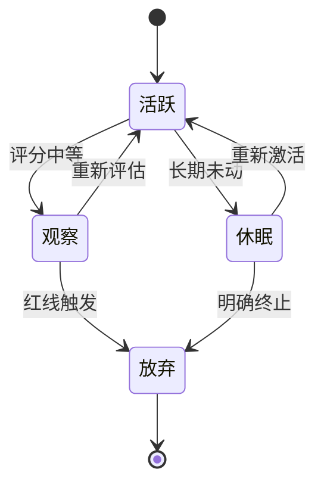
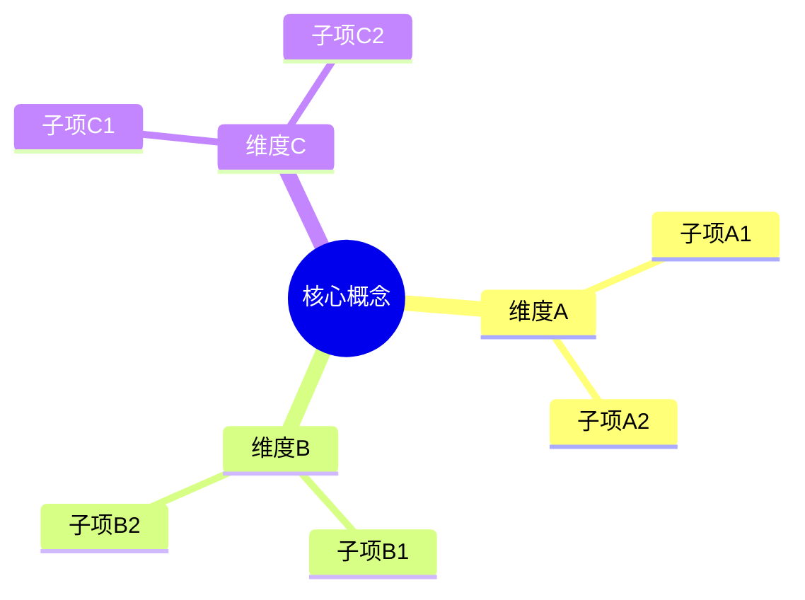
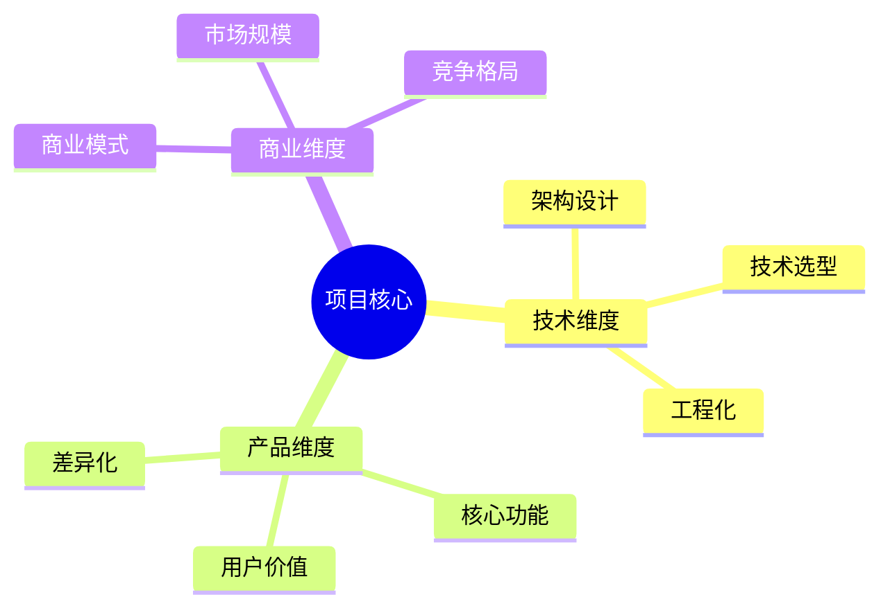

# ref-charts.md · 图表模板库与风格规范

> 黑客松路演魔术师参考文档 · 图表生成模板与暗色科技风规范

---

## 统一视觉规范

### 配色系统
| 变量 | 色值 | 用途 |
|------|------|------|
| --bg-primary | #1A1A2E | 主背景 |
| --bg-secondary | #16213E | 次背景 |
| --bg-card | #0F3460 | 卡片背景 |
| --accent-cyan | #00D4FF | 主强调色 |
| --accent-purple | #7B2FF7 | 次强调色 |
| --accent-pink | #F94CA4 | 警示/高亮 |
| --text-primary | #E8E8E8 | 主文本 |
| --text-secondary | #A0A0B8 | 次文本 |

### 字体
- 中文：Sarasa Gothic SC, Microsoft YaHei
- 英文/代码：Consolas, monospace

### 通用原则
- 所有图表必须适配暗色背景
- 线条/文字颜色用 cyan/purple 为主
- 数据系列用 cyan→purple→pink 渐变
- 网格线用 rgba(0,212,255,0.1)
- 图表必须内嵌HTML，不依赖外部图片

---

## 一、流程图（Mermaid.js）

### 1.1 工作流流程图模板

**适用**：展示项目的核心工作流、处理流程。

**模板代码**：


**暗色主题配置**：
```javascript
mermaid.initialize({
  theme: 'base',
  themeVariables: {
    primaryColor: '#0F3460',
    primaryTextColor: '#E8E8E8',
    primaryBorderColor: '#00D4FF',
    lineColor: '#00D4FF',
    secondaryColor: '#16213E',
    tertiaryColor: '#1A1A2E',
    background: '#1A1A2E',
    mainBkg: '#0F3460',
    secondBkg: '#16213E',
    textColor: '#E8E8E8',
    nodeBorder: '#00D4FF',
    clusterBkg: '#16213E',
    clusterBorder: '#7B2FF7'
  }
});
```

### 1.2 决策树模板

**适用**：展示分支逻辑、分类判断。



### 1.3 状态机模板

**适用**：展示状态流转、生命周期。



### 1.4 思维导图模板

**适用**：展示概念框架、分类维度。



---

## 二、架构图（HTML/CSS网格）

### 2.1 分层架构模板

**适用**：展示系统分层、模块关系。

**模板代码**：
```html
<div style="display:grid;gap:16px;margin:20px 0">
  <div style="background:#0F3460;border:1px solid #00D4FF;border-radius:8px;padding:16px;text-align:center">
    <strong style="color:#00D4FF">表现层</strong>
    <p style="color:#A0A0B8;font-size:14px;margin-top:8px">UI / 路由 / 页面</p>
  </div>
  <div style="background:#0F3460;border:1px solid #00D4FF;border-radius:8px;padding:16px;text-align:center">
    <strong style="color:#00D4FF">业务层</strong>
    <p style="color:#A0A0B8;font-size:14px;margin-top:8px">核心逻辑 / 数据处理</p>
  </div>
  <div style="background:#0F3460;border:1px solid #00D4FF;border-radius:8px;padding:16px;text-align:center">
    <strong style="color:#00D4FF">数据层</strong>
    <p style="color:#A0A0B8;font-size:14px;margin-top:8px">存储 / 持久化</p>
  </div>
</div>
```

### 2.2 矩阵展示模板

**适用**：展示多维矩阵、MECE分类。

**模板代码**：
```html
<div style="display:grid;grid-template-columns:repeat(3,1fr);gap:12px;margin:20px 0">
  <div style="background:#0F3460;border-radius:8px;padding:16px;border-left:3px solid #00D4FF">
    <strong style="color:#00D4FF">维度1</strong>
    <p style="color:#A0A0B8;font-size:14px">说明</p>
  </div>
  <div style="background:#0F3460;border-radius:8px;padding:16px;border-left:3px solid #7B2FF7">
    <strong style="color:#7B2FF7">维度2</strong>
    <p style="color:#A0A0B8;font-size:14px">说明</p>
  </div>
  <div style="background:#0F3460;border-radius:8px;padding:16px;border-left:3px solid #F94CA4">
    <strong style="color:#F94CA4">维度3</strong>
    <p style="color:#A0A0B8;font-size:14px">说明</p>
  </div>
</div>
```

---

## 三、数据图（Chart.js）

### 3.1 雷达图模板

**适用**：展示多维度评分、能力分布。

**模板代码**：
```html
<canvas id="radarChart" width="400" height="400"></canvas>
<script src="https://cdn.jsdelivr.net/npm/chart.js"></script>
<script>
new Chart(document.getElementById('radarChart'), {
  type: 'radar',
  data: {
    labels: ['维度1', '维度2', '维度3', '维度4', '维度5'],
    datasets: [{
      label: '评测成绩',
      data: [4.8, 4.7, 4.6, 4.8, 4.7],
      backgroundColor: 'rgba(0,212,255,0.2)',
      borderColor: '#00D4FF',
      pointBackgroundColor: '#00D4FF',
      pointBorderColor: '#fff',
      pointRadius: 5
    }]
  },
  options: {
    responsive: true,
    plugins: {
      legend: { labels: { color: '#E8E8E8' } }
    },
    scales: {
      r: {
        beginAtZero: true,
        max: 5,
        grid: { color: 'rgba(0,212,255,0.1)' },
        angleLines: { color: 'rgba(0,212,255,0.1)' },
        pointLabels: { color: '#E8E8E8', font: { size: 14 } },
        ticks: { color: '#A0A0B8', backdropColor: 'transparent' }
      }
    }
  }
});
</script>
```

### 3.2 柱状图模板

**适用**：展示对比数据、增长趋势。

**模板代码**：
```html
<canvas id="barChart" width="400" height="300"></canvas>
<script src="https://cdn.jsdelivr.net/npm/chart.js"></script>
<script>
new Chart(document.getElementById('barChart'), {
  type: 'bar',
  data: {
    labels: ['Q1', 'Q2', 'Q3', 'Q4'],
    datasets: [{
      label: '下载量',
      data: [1200, 1800, 2400, 3100],
      backgroundColor: [
        'rgba(0,212,255,0.6)',
        'rgba(123,47,247,0.6)',
        'rgba(249,76,164,0.6)',
        'rgba(0,212,255,0.8)'
      ],
      borderColor: ['#00D4FF', '#7B2FF7', '#F94CA4', '#00D4FF'],
      borderWidth: 1
    }]
  },
  options: {
    responsive: true,
    plugins: {
      legend: { labels: { color: '#E8E8E8' } }
    },
    scales: {
      y: {
        beginAtZero: true,
        grid: { color: 'rgba(0,212,255,0.1)' },
        ticks: { color: '#A0A0B8' }
      },
      x: {
        grid: { color: 'rgba(0,212,255,0.1)' },
        ticks: { color: '#A0A0B8' }
      }
    }
  }
});
</script>
```

### 3.3 折线图模板

**适用**：展示时间趋势、增长曲线。

**模板代码**：
```html
<canvas id="lineChart" width="400" height="300"></canvas>
<script src="https://cdn.jsdelivr.net/npm/chart.js"></script>
<script>
new Chart(document.getElementById('lineChart'), {
  type: 'line',
  data: {
    labels: ['1月', '2月', '3月', '4月', '5月', '6月'],
    datasets: [{
      label: '用户增长',
      data: [100, 300, 600, 1000, 1500, 2200],
      borderColor: '#00D4FF',
      backgroundColor: 'rgba(0,212,255,0.1)',
      fill: true,
      tension: 0.4,
      pointBackgroundColor: '#00D4FF',
      pointRadius: 5
    }]
  },
  options: {
    responsive: true,
    plugins: {
      legend: { labels: { color: '#E8E8E8' } }
    },
    scales: {
      y: {
        beginAtZero: true,
        grid: { color: 'rgba(0,212,255,0.1)' },
        ticks: { color: '#A0A0B8' }
      },
      x: {
        grid: { color: 'rgba(0,212,255,0.1)' },
        ticks: { color: '#A0A0B8' }
      }
    }
  }
});
</script>
```

---

## 四、概念图（Mermaid mindmap）

### 4.1 维度展开模板

**适用**：展示框架维度、分类体系。



---

## 五、图表选择决策树

```
需要展示什么？
├── 流程/步骤 → Mermaid流程图
├── 判断/分支 → Mermaid决策树
├── 状态变化 → Mermaid状态机
├── 系统结构 → HTML/CSS分层架构
├── 多维分类 → HTML/CSS矩阵
├── 评分/能力 → Chart.js雷达图
├── 数据对比 → Chart.js柱状图
├── 增长趋势 → Chart.js折线图
└── 概念框架 → Mermaid思维导图
```

---

## 六、图表降级策略

| 场景 | 降级方案 |
|------|----------|
| Mermaid渲染失败 | 降级为HTML/CSS流程卡片 |
| Chart.js加载失败 | 降级为HTML表格 + 文字描述 |
| 数据不足以画图 | 降级为列表 + 文字说明 |
| 图表类型不确定 | 默认用表格，最通用 |

---

## 七、图表与路演类型匹配建议

| 路演类型 | 推荐图表 | 理由 |
|----------|----------|------|
| 竞赛Demo | 流程图 + 架构图 | 展示技术深度 |
| 投资路演 | 柱状图 + 折线图 | 展示增长数据 |
| 技术答辩 | 架构图 + 流程图 | 展示系统设计 |
| 产品推广 | 雷达图 + 对比表 | 展示优势维度 |
| 电梯演讲 | 不需要图表 | 30秒来不及看 |
| 展位展示 | 架构图 + 流程图 | 评委驻足快速理解 |
| 技术讲课 | 流程图 + 概念图 | 知识结构化呈现 |
| 资源对接 | 柱状图 + 雷达图 | 价值量化展示 |
